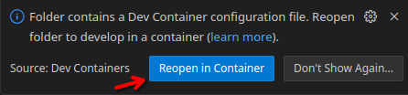

# Catapult SDK dev container

A dev container for use with [Catapult Studio](https://marketplace.visualstudio.com/items?itemName=ImaginationTech.catapult-studio).

You may be interested in using this if:

1. You are running a distribution that conflicts with the requirements of the [catapult-sdk](https://github.com/imgtec-riscv/catapult-sdk) package.
2. You would like a reduced set of dependencies to wrangle: just VS Code with the [Dev Containers](https://marketplace.visualstudio.com/items?itemName=ms-vscode-remote.remote-containers) extension, and an OCI-compliant container runtime (I'm using Docker on Linux).

Using the dev container means VS Code will pre-install the Catapult Studio extension pack into the environment it expects.

## Getting Started

To open the current directory in the dev container, use:

```
cat >.devcontainer.json <<EOF
{
    "image": "ghcr.io/sethp/catapult-sdk-devcontainer"
}
EOF

code .
```

Which, once the "Dev Containers" extension is installed, will prompt to re-open the folder inside the dev container. Click "Reopen in Container":



If you've missed the prompt, searching the Command Palette for "reopen" should offer the "Dev Containers: Reopen in Container":


## udev Rules ("drivers")

The container doesn't currently manage any of the expected udev rules that set permissions to world read/writable.

Note that no "driver" (kernel module) installation is required on Linux, but you may see a "permission denied" error attempting to access the board depending on your udev configuration in `/etc/udev` (usually `/etc/udev/rules.d/`). Running the `install_drivers` script (found in e.g. vivado, not this project) will add rules to grant world read/write/execute permissions on your devices.

## TODO

- [~] "install drivers" ?
- [ ] making sure all the right /sys/dev &c passthroughs are set up (cf. https://stackoverflow.com/questions/71366286/how-to-mount-dev-bus-usb-on-vscodes-devcontainer-for-docker )
- [ ] dependabot?

## Contributing

Generating the lock file for reproducible builds happens via:

```
npx @devcontainers/cli upgrade --workspace-folder .
```
